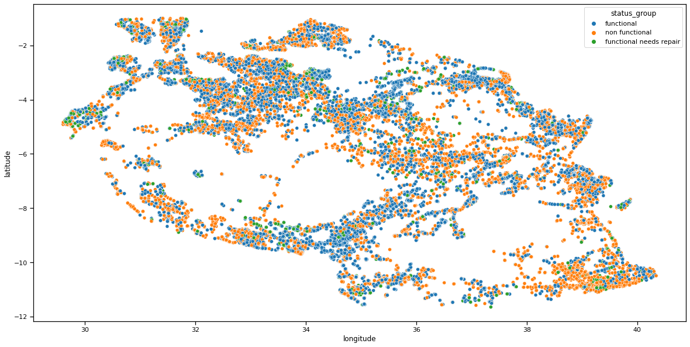
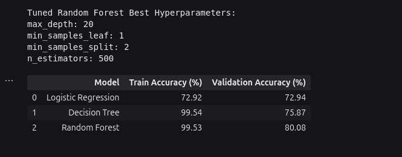
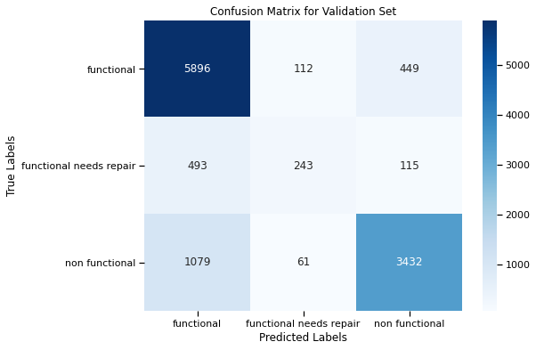
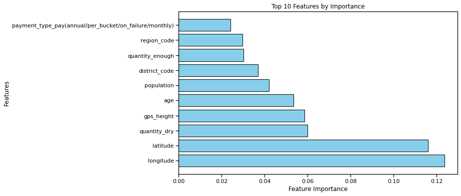
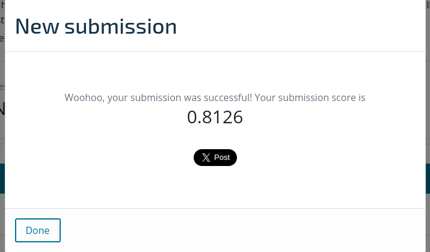

# Tanzania_water_wells

Predicting Tanzania Water Pumps Functionality
Author : Edwin Maina

# Business Understanding
Access to clean water is a fundamental human need and a key for public health, economic development, and social well-being.

In Tanzania, communities heavily rely on water wells for their daily water supply. However, many of these water points become non-functional over time due to poor maintenance, environmental conditions, or inadequate infrastructure.

This project aims to build a predictive models to assess the functionality status of water wells in Tanzania. The models will help stakeholders prioritize maintenance efforts, allocate resources more effectively, and ensure that water wells remain operational for the communities that depend on them.

# Business Problem
Tanzania's water supply system is characterized by frequent water pump breakdowns resulting from lack of proper maintenance and inefficient management. This leads to disruptions in water supply, exacerbating the acute shortage of clean water and socio-economic losses.

# Objectives
The government of Tanzania, in collaboration with Majikote NGO, aims to enhance access to clean water by improving the maintenance and functionality of water wells across the country. To achieve this, I was tasked with developing a model that best predicts water point sustainability risk levels across the country projected by learning from current point data available to guide stakeholders' decisions through highlighting:

 - Most dilapidated wells that should be prioritized for maintenance, repairs.
- Factors affecting the functionality of water wells
- Data-driven recommendations that are responsive to stakeholders toimprove management practices and  water accessibility.

## Data
***
The data used in this project is from the <a href="https://www.drivendata.org/competitions/7/pump-it-up-data-mining-the-water-table/page/23/"> 

Data Understanding
The comes from Driven Data - Tanzanian Water Wells

Target

functional : the well is operational and there are no repairs needed
functional needs repair : the well is operational, but needs repairs
non functional : the well is not operational

## Exploratory Data Analysis

#### visualized the distribution of water wells and their status

#### Distribution of Target Variables

## Modelling

Logistic regression, Decision trees and random forest models were evaluated and the best performing model was picked to be the final model.The Random Forest Classifier was picked as the final model, with its parameters being the best parameters found through grid search.

## Analysis

**Accuracy: 80.56%**

The model achieved an accuracy of about 80.5%, indicating a fairly good performance in classifying the instances correctly.
Macro Avg F1-Score: 0.68
This average F1-score across classes is moderate, as it doesn't consider class imbalance.
Weighted Avg F1-Score: 0.80
The weighted F1-score reflects the model's better performance in more frequently predicted classes (Functional and Non-functional).

The most important features according to the final model are longitude, latitude,quantity_dr and age, region code and population. 

This features can be presented to the stakeholders(the government of Tanzania), to help them improve the maintenance/repair operations of water pumps.

## Limitations

The overall data used was not up to date 
The data was  not reliably gathered, it contained a lot of placeholders in important features such as population and amount_tsh, hence the results obtained are not particularly accurate.

## Recommendations

Work with the local government to ensure more accurate gathering of data

Data collected should highlight more on non_functional pumps or those in need of repairs

**Focus on Random Forest Model:**

The Random Forest model emerges as the most promising model for predicting waterpoint conditions.
Resources should be allocated towards further refining and deploying this model for practical use.

**Financial Barriers:**

Recognize that paying for maintenance services poses a significant challenge, given the average income levels in Tanzania.
Introduce financial support programs at the local government level and explore sustainable payment models to ensure continued waterpoint maintenance.

**Continuous Data Collection**

efforts to gather consistent, high-quality data to improve predictive models and enable preemptive waterpoint maintenance.

### Links

[Presentation](Tanzaniawaterpumpspresentation.pdf)

For questions or support, reach out via email: [your-mainaedwin24@gmailcom](Edwin:mainaedwin24@gmail.com)

